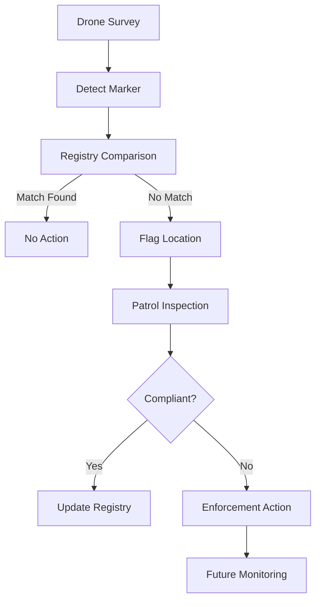

```mermaid
flowchart TD
    A[Drone Survey]
    A --> B[Detect Marker]
    B --> C[Registry Comparison]
    C -->|Match Found| D[No Action]
    C -->|No Match| E[Flag Location]
    E --> F[Patrol Inspection]
    F --> G{Compliant?}
    G -->|Yes| H[Update Registry]
    G -->|No| I[Enforcement Action]
    I --> J[Future Monitoring]
```