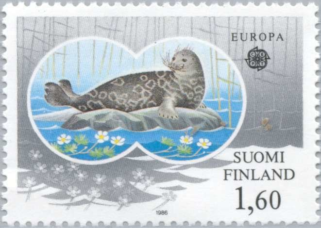
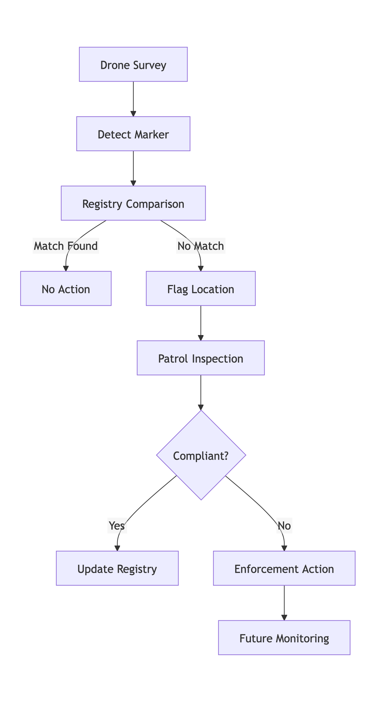

# NorppaTurva White Paper

Proposal for a digital fishing equipment registry and targeted monitoring to protect the endangered Saimaa ringed seal

__Date:__ 21 July 2026  
__Project:__ NorppaTurva  
__Status:__ Public Discussion Draft  
__Author:__ Independent Proposal by Forester Thomas Moon  

## Executive Summary

The Saimaa ringed seal (*Pusa saimensis*) is one of the world's rarest seal species and is found exclusively in Finland's Lake Saimaa. Despite remarkable conservation success over recent decades, the population remains vulnerable due to its small size, limited genetic diversity, climate-related breeding challenges, and continued mortality in fishing equipment. Recent population estimates place the population at approximately 530 individuals, while fishing equipment mortality remains one of the most significant verified causes of death.

In 2026, at least ten fishing-equipment-related seal deaths had already been reported by mid-July, exceeding the long-term average. Some cases involved illegal or improperly marked fishing equipment, highlighting the continuing challenge of preventing non-compliant fishing practices within seal habitat.

This white paper proposes a pilot project, __NorppaTurva__, combining:

1. A digital fishing equipment registry;
2. Risk-based monitoring of high-priority seal habitat;
3. Drone-assisted detection of fishing equipment markers;
4. Targeted patrol inspections;
5. Data-driven evaluation of enforcement outcomes.

The objective is not to replace existing conservation measures, but to assess whether modern monitoring tools can improve detection of unregistered fishing equipment and increase the effectiveness of enforcement efforts.

## 1. Introduction

The conservation of the Saimaa ringed seal represents one of Finland's most significant environmental achievements. Following a severe decline during the twentieth century, the population has steadily increased through a combination of legal protection, fishing restrictions, habitat protection, scientific research, and public engagement.

However, recovery remains incomplete.

The species continues to face multiple threats:

- Bycatch in fishing equipment;
- Climate change;
- Habitat disturbance;
- Small population size;
- Limited genetic diversity.

The purpose of this proposal is to investigate whether modern monitoring technologies can contribute to reducing one of these threats: fishing-equipment mortality.

## 2. Background

### 2.1 The Saimaa Ringed Seal

The Saimaa ringed seal is endemic to Lake Saimaa in southeastern Finland and has been isolated from marine seal populations since the last Ice Age. This long isolation has resulted in a unique freshwater seal population found nowhere else on Earth.

Recent population estimates indicate approximately 530 individuals, reflecting substantial recovery from historical lows. Nevertheless, the population remains small from a conservation perspective, making each mortality event significant.

### 2.2 Fishing-Equipment Mortality

Research identifies accidental capture in fishing equipment as one of the most significant human-caused threats to the species. Over the past three decades, bycatch has been the most frequently verified cause of death.

Jounela et al. (2024) found that:

- Fishing restrictions have significantly improved juvenile survival.
- Bycatch mortality still occurs.
- Actual mortality is likely higher than observed mortality.
- Current bycatch levels may exceed sustainable thresholds in some years.

### 2.3 Recent Cases

In July 2026, Metsähallitus reported the tenth known fishing-equipment-related seal death of the year. The latest case involved an illegal trap lacking required markings and ownership information. The trap exceeded permitted specifications and was discovered only after a member of the public reported a dead seal.

Such incidents raise questions regarding detection, enforcement, and prevention mechanisms.

## 3. Problem Statement

### 3.1 Scale of Lake Saimaa

Lake Saimaa is a vast and geographically complex lake system covering roughly 4,400 square kilometres. Numerous islands, bays, and waterways create significant challenges for monitoring and enforcement activities.

### 3.2 Current Monitoring Challenges

Current enforcement relies largely upon:

- Fishing regulations;
- Patrol inspections;
- Public reporting;
- Post-incident investigations.

In some cases, illegal equipment may remain in the water for extended periods without detection.

### 3.3 Key Question

Can modern monitoring systems improve the identification of unregistered fishing equipment before it causes harm to protected wildlife?

## 4. Scientific Basis

### 4.1 Population Recovery

The recovery of the Saimaa ringed seal demonstrates that targeted conservation measures can be effective. Population growth has been associated with expanded fishing restrictions, improved protection measures, and enhanced conservation management.

### 4.2 Seal Movements

GPS and telemetry studies demonstrate that seals do not use Lake Saimaa uniformly. Important habitats, breeding regions, and movement corridors are concentrated in specific areas.

This suggests that surveillance and enforcement may also be prioritized spatially.

###  4.3 Bycatch Mitigation

Research indicates that fishing restrictions reduce mortality risk. However, restrictions alone cannot completely eliminate mortality arising from illegal, unregistered, or non-compliant fishing equipment.

## 5. NorppaTurva Concept

### 5.1 Guiding Principles

NorppaTurva is based on five principles:

1. Support responsible fishing.
2. Improve enforcement efficiency.
3. Minimize surveillance impacts.
4. Target high-risk areas.
5. Evaluate outcomes scientifically.

### 5.2 Core Idea

Rather than attempting to identify illegal equipment directly from the air, the system seeks to identify fishing markers that may not correspond to registered fishing equipment.

The objective is not to automate law enforcement but to prioritize inspection efforts.

## 6. Digital Fishing Equipment Registry

### 6.1 Purpose

A digital registry would create a database of fishing equipment operating within designated seal conservation areas.

Potential data fields:

- Fishing equipment identifier;
- Equipment type;
- Permit information;
- Fishing area;
- Registration status.

### 6.2 Benefits

Potential benefits include:

- More effective enforcement;
- Better data collection;
- Improved transparency;
- Easier reporting of lost fishing equipment.

### 6.3 Pilot Scope

A pilot could initially focus on selected high-priority areas:

- Pihlajavesi;
- Haukivesi;
- Other key seal habitats.

## 7. Drone-Assisted Monitoring

### 7.1 Role of Drones

Drones would not replace patrols.

Instead, drones would:

- Detect floating markers;
- Record geospatial observations;
- Generate inspection targets.

### 7.2 Technical Feasibility

Based on current drone capabilities, floating fishing markers are likely detectable under favourable conditions using visual imaging systems.

The main technical challenge is not detection itself but distinguishing compliant and non-compliant fishing equipment.

### 7.3 Monitoring Schedule

Potential monitoring options include:

Monthly surveys;
Bi-weekly surveys;
Event-triggered surveys following incidents.

The pilot should evaluate the most cost-effective schedule.

## 8. Targeted Monitoring

### 8.1 Workflow

### 8.2 Patrol Prioritization

Inspection resources would focus on:

- Unregistered markers;
- Repeat detections;
- High-priority seal habitat.

## 9. Feasibility Assessment

### 9.1 Operational Feasibility

Targeted monitoring of priority habitat appears substantially more realistic than attempting to survey the entire Lake Saimaa system.

### 9.2 Economic Feasibility

Estimated pilot costs may fall within the range of many existing conservation and research projects.

Major cost components:

- Equipment;
- Personnel;
- Data analysis;
- Patrol operations.

### 9.3 Regulatory Feasibility

Any pilot would require:

- Cooperation with authorities;
- Compliance with drone regulations;
- Consideration of privacy requirements;
- Stakeholder engagement.

## 10. Community Impact

### 10.1 Responsible Fishers

The proposal aims to support responsible fishing rather than restrict lawful activities.

Potential benefits include:

- Reduced illegal competition;
- Increased visibility of best practices;
- Enhanced public trust.

### 10.2 Local Residents

Careful flight planning may reduce nuisance impacts.

Measures may include:

- Seasonal restrictions;
- No-fly areas near breeding sites;
- Limited flight frequencies;
- Use of quieter aircraft systems.

### 10.3 Seal Welfare

Monitoring itself must not become a conservation risk.

The pilot should include guidelines minimizing disturbance to wildlife.

## 11. Success Metrics

A pilot should establish measurable outcomes:

### Enforcement

- Number of inspections;
- Number of unregistered fishing equipment detections;
- Time to inspection.

### Conservation

- Fishing-equipment mortality trends;
- Incidents involving illegal equipment;
- Spatial distribution of risk.

### Operational

- Survey coverage;
- Detection accuracy;
- Cost per detection.

## 12. Limitations

This proposal acknowledges several uncertainties:

- Detection rates remain untested.
- Registry implementation may require policy changes.
- Illegal actors may adapt their behaviour.
- Cost-effectiveness remains unknown.

These uncertainties reinforce the need for a pilot project rather than immediate large-scale deployment.

## 13. Conclusions

The recovery of the Saimaa ringed seal is one of Finland's greatest conservation successes. However, recent mortality events demonstrate that fishing-equipment-related deaths remain a persistent challenge.

NorppaTurva proposes a research-driven pilot evaluating whether digital registration, drone-assisted observation, and targeted monitoring can improve detection of illegal fishing equipment in critical seal habitat.

The proposal does not assume success.

Instead, it asks a question:

> Can modern monitoring tools help protect one of the world's rarest seal species while supporting responsible fishing and efficient use of conservation resources?

That question deserves scientific evaluation.

## References

Jounela, Pekka, Miina Auttila, Riikka Alakoski, Marja Niemi, and Mervi Kunnasranta. 2024. “Effects of Fishing Restrictions on the Recovery of the Endangered Saimaa Ringed Seal (Pusa hispida saimensis) Population.” PLOS ONE 19 (12): e0311255.

Kunnasranta, Mervi, Marja Niemi, Miina Auttila, Mia Valtonen, Juhana Kammonen, and Tommi Nyman. 2021. “Sealed in a Lake: Biology and Conservation of the Endangered Saimaa Ringed Seal.” Biological Conservation 253:108908.

Niemi, Marja, Miina Auttila, Markku Viljanen, and Mervi Kunnasranta. 2012. “Movement Data and Their Application for Assessing the Current Distribution and Conservation Needs of the Endangered Saimaa Ringed Seal.” Endangered Species Research 19:99–108.

Metsähallitus. 2025 Population Estimate and Saimaa Ringed Seal Monitoring Reports.

Yle News and related reporting on 2026 fishing equipment mortality incidents.